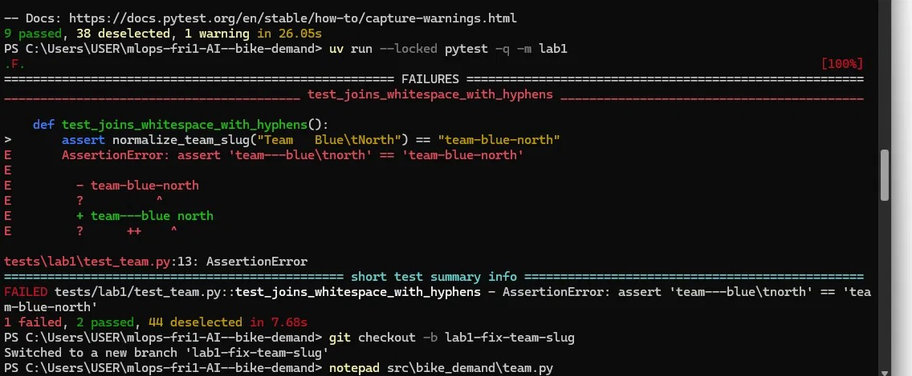
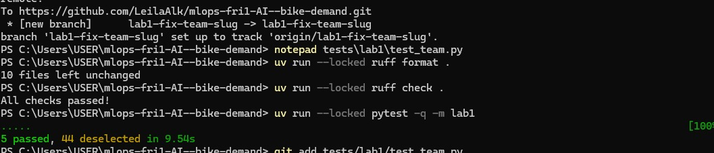
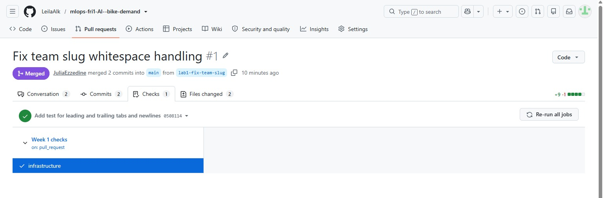

# Week 1, Labs 1–2: team evidence

## Team and roles

Team AI: Julia (@JuliaEzzedine), Leila (@LeilaAlk), Talia (@taliaalg), Andrea (@andrea180904).
Lab 1 fix (PR #1): Julia driver and author, Leila reviewer and repository owner.
Lab 1 docs PR: Talia driver and author, Andrea reviewer.
Lab 2 roles: to be decided at the start of Lab 2.

## Repository and pull requests

Repository: https://github.com/LeilaAlk/mlops-fri1-AI--bike-demand
PR #1 "Fix team slug whitespace handling": branch lab1-fix-team-slug, commits 6c2c77f and 0508114, approved by Leila, merged to main as 9b0a16a.
Docs PR: branch lab1-docs, working agreement, Lab 1 report and docstring.

## Setup, preflight and quality checks (commands and actual results)

Windows x86_64, Python 3.12.15, uv 0.12.24.
- `uv sync --locked` -> 97 packages installed
- `uv run --locked python -m bike_demand.preflight` -> Preflight passed: imports, frozen snapshot and writable outputs.
- `uv run --locked pytest -q -m infra` -> 9 passed
- `uv run --locked pytest -q -m lab1` -> 1 failed, 2 passed before the fix (intentional failure); 5 passed after the fix
- `uv run --locked ruff check .` -> All checks passed!
- `uv run --locked ruff format --check .` -> 10 files already formatted (after `ruff format .` fixed 2 files)
- CI: workflow "Week 1 checks", job "infrastructure" -> passed on 0508114

## Data identity, validator checks and added test

Lab 2: not started.

## Partition counts, boundaries and held test rows

Lab 2: not started.

## Comparator and RF: run IDs, validation MAEs, metadata/readback

Lab 2: not started.

## Optional stretch, after the core: unchanged-config repeat (new run IDs, history, differences)

Not attempted.

## Fault diagnosis and your own Fault B

Lab 2: not started.

## Review observation and author's response

PR #1: Leila asked for a test on leading/trailing tabs and newlines; Julia added `test_trims_tabs_and_newlines` in 0508114 (lab1: 5 passed). Leila also asked for a one-line docstring on `normalize_team_slug`; it was not in PR #1 and is added in the docs PR.

## Contribution and assistance/recovery acknowledgement

Julia: bug fix and two tests (PR #1). Leila: repository creation, access management, review of PR #1. Talia: working agreement, Lab 1 report, docstring (docs PR). Andrea: review of the docs PR.
Assistance: course starter repository; an AI assistant (Claude) helped with the setup, the bug diagnosis, the fix, the test ideas and the wording of the reports.
Recovery: first push rejected because the repository was created with a README (merged unrelated histories), then because the token lacked the workflow scope (scope added).

## Blockers and next action

No blocker. Leila and Andrea confirm their local setup. Lab 2 driver and reviewer to be decided at the start of Lab 2.

## Screenshots

Save images in `reports/images/`; embed each with a caption naming the commit or run
it shows (for example PR checks, MLflow runs, validator output). Hide tokens and
personal data.

Failing `pytest -m lab1` on the starter commit a869cc8: 1 failed, 2 passed.

Passing `pytest -m lab1` on commit 0508114: 5 passed.

"Week 1 checks / infrastructure" passed on PR #1, commit 0508114.